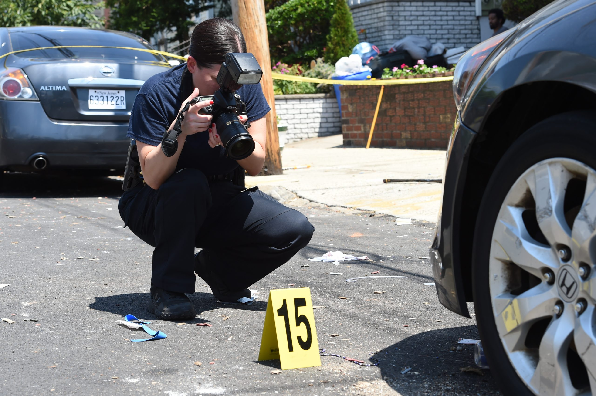

Yu He (yh3430), Wenshan Qu (wq2160), Jiayao Sun (js5962), Yimiao Pang (yp2608), Yunxi Zhang (yz4186)

 

## Screencast

<iframe width="850" height="580" src="https://www.youtube.com/embed/m8srVzA9iqA" title="YouTube video player" frameborder="0" allow="accelerometer; autoplay; clipboard-write; encrypted-media; gyroscope; picture-in-picture" allowfullscreen></iframe>

 

## Motivation

### Covid 19 Pandemic impact

Everything experienced in 2020 is unprecedented in the history of New York.

During the COVID-19 pandemic, with global public health crisis, hundreds of thousands of deaths, hospitals' overwhelming, economic stagnation, school and religious sites closures, society has lost its normal foundation. The [Covid-19 pandemic](https://www.hopkinsmedicine.org/health/conditions-and-diseases/coronavirus) have totally reshaped our known society. Our community is facing multi-lateral challenges such as, [economic impact](https://www.census.gov/library/stories/2021/03/initial-impact-covid-19-on-united-states-economy-more-widespread-than-on-mortality.html), [healthcare crisis](https://www.nytimes.com/2021/12/03/nyregion/covid-cases-surge-upstate-ny.html),
[violent crimes](https://gothamist.com/news/why-are-shootings-and-murders-rise-nyc), and [supply chain crisis](https://www.ey.com/en_sg/supply-chain/how-covid-19-impacted-supply-chains-and-what-comes-next). Gun violence are now becoming a direct threat to our safety.

### Gun violence is threatning NYC

 

According to the New York Post, data from the New York City Police Department shows that as of December 7, 2020, there have been 1,433 shootings in New York City, with a total of 1,756 victims of gun violence, almost twice the number in the same period in 2019. The surge in shootings is jeopardizing the rights of the public. We need immediate action to ensure a safe living environment for our community.

If you want to know more about the gun violence in NYC before and during the Covid-19 pandemic, our website can provide useful information.

## Links

Here are useful links for you to further explore our project:

* Our GitHub repo for this website could be found [here](https://github.com/WenshanQu/NYC_shooting_fact.github.io).

* Here is [another GitHub repo](https://github.com/WenshanQu/Final_Project_NYC_Shooting) including files and codes that could not be included in our web-repo, such as codes for generating zip-code.

* Our Shiny repo could be found [here](https://wenshanqu.shinyapps.io/nyc_shooting_fact/).

