Yu He (yh3430), Wenshan Qu (wq2160), Jiayao Sun (js5962), Yimiao Pang (yp2608), Yunxi Zhang (yz4186)

***

## Motivation

The proliferation of guns and gun violence in the United States have serious consequences. In addition to causing many casualties, it also spawned more violence and crime, reducing public security in American society. According to the Council on Criminal Justice data, there has been a sharp increase in homicides in the United States in 2020. Data from 21 cities showed that compared with the fall of 2019, there were 610 homicides in the same period in 2020, malicious injury cases increased by 15% and 13%, and shooting cases increased by 15% and 16%, respectively. According to the New York Post, data from the New York City Police Department shows that as of December 7, 2020, there have been 1,433 shootings in New York City, with a total of 1,756 victims of gun violence, almost twice the number in the same period in 2019. The surge in shootings is jeopardizing the rights of the public. We need immediate action to reshape our community to provide a safe living environment for our community members.

***

## Initial Questions

* What is a relatively safe time to go outside in a day?
* How many shooting incidents have occurred in the past few years in the nearby area?
* Does the month affect the possibility of shooting incidents? Are shootings fluctuating like a seasonal flu?
* How are the shooting incidents distributed in NYC?
* How does COVID-19 influence the shooting incidents rate?
* Is there any way to control the number of shooting incidents in NYC?

***

## Related Work

A Chinese student's murder on a street near the University of Chicago campus has resonated the city and even the country of facing the rising violence. Our group want to show our concern and to call for attention for the gun violence issue through this project. 


## Data

###  Data Source
* The NYPD Shooting Incident Data (Year To Date) - [link](https://data.cityofnewyork.us/Public-Safety/NYPD-Shooting-Incident-Data-Year-To-Date-/5ucz-vwe8)

  The dataset is downloaded from _NYC Open Data_. It contains 1531 shooting incidents that occurred in NYC from Jan. 1th 2021 to Sep. 30th 2021. The data was manually extracted every quarter and reviewed by the Office of Management Analysis and Planning. Each observation represents a shooting incident in NYC and includes information about the event, the location, the time of occurrence, and the information related to suspect and victim demographics.


* The NYPD Shooting Incident Data (Historic) - [link](https://data.cityofnewyork.us/Public-Safety/NYPD-Shooting-Incident-Data-Historic-/833y-fsy8)

  The dataset is downloaded from _NYC Open Data_. It contains 26.3K shooting incidents that occurred in NYC during the 2006 and 2020 fiscal years. The information contained in this data is the same as the NYPD Shooting Incident Data(Year To Date).
  
* The US County-level COVID-19 Data(us-counties) - [link](https://github.com/nytimes/covid-19-data)

  The dataset is downloaded from _The New York Times_.  It contains 1.99M entries and 6 columns with COVID-19 cases and deaths each day from Jan 21, 2020 until now by counties in the US.

### Data Cleaning and Processing

The first step of raw data cleaning combines each year’s data into one file. Then the date variable was separated into year, month, and day variables for later analysis. The missing value and unexpected values were omitted from the dataset. The zip-code generating process will be illustrated in the "Shiny" part of this report.

### Data Description

The NYPD Shooting Data was collected from the NYC Open Data, The dataset includes 1,531 rows and 19 columns. The variables included in the dataset were listed below:

| Variable                                                                                           | Description                                                                                                                                                                            |   |   |   |
|----------------------------------------------------------------------------------------------------|----------------------------------------------------------------------------------------------------------------------------------------------------------------------------------------|---|---|---|
| incident_key                                                                                       | Randomly generated persistent ID for each arrest                                                                                                                                       |   |   |   |
| occur_date                                                                                         | Exact date of the shooting incident                                                                                                                                                    |   |   |   |
| occur_time                                                                                         | Exact time of the shooting incident                                                                                                                                                    |   |   |   |
| boro                                                                                               | Boro where the shooting incident occurred                                                                                                                                              |   |   |   |
| precinct                                                                                           | Precinct where the shooting incident occurred                                                                                                                                          |   |   |   |
| jurisdiction_code                                                                                  | Jurisdiction where the shooting incident occurred.     Jurisdiction codes 0(Patrol), 1(Transit) and 2(Housing) represent NYPD whilst codes 3 and more represent non NYPD jurisdictions |   |   |   |
| Location_desc                                                                                      | Location of the shooting incident                                                                                                                                                      |   |   |   |
| statistical_murder_flag                                                                            | Shooting resulted in the victim’s death which would be counted as a murder                                                                                                             |   |   |   |
| perp_age_group                                                                                     | Perpetrator’s age within a category                                                                                                                                                    |   |   |   |
| perp_sex                                                                                           | Perpetrator’s sex description                                                                                                                                                          |   |   |   |
| perp_race                                                                                          | Perpetrator’s race description                                                                                                                                                         |   |   |   |
| vic_age_group                                                                                      | Victim’s age within a category                                                                                                                                                         |   |   |   |
| vic_sex                                                                                            | Victim’s sex description                                                                                                                                                               |   |   |   |
| vic_race                                                                                           | Victim’s race description                                                                                                                                                              |   |   |   |
| x_coord_cd                                                                                         | Midblock X-coordinate for New York State Plane Coordinate System, Long Island Zone, NAD 83, units feet (FIPS 3104)                                                                     |   |   |   |
| y_coord_cd                                                                                         | Midblock Y-coordinate for New York State Plane Coordinate System, Long Island Zone, NAD 83, units feet (FIPS 3104)                                                                     |   |   |   |
| latitude                                                                                           | Latitude coordinate for Global Coordinate System, WGS 1984, decimal degrees (EPSG 4326)                                                                                                |   |   |   |
| longitude                                                                                          | Longitude coordinate for Global Coordinate System, WGS 1984, decimal degrees (EPSG 4326)                                                                                               |   |   |   |
| lon_lat                                                                                            | Longitude and Latitude Coordinates for mapping                                                                                                                                         |   |   |   |

## Data Visualization

With 19 columns listed in dataset such as occur_time, vic_age_group, latitude and longitude, NYPD Shooting Incident Data presented content-rich information about every shooting incident that occurred in NYC. These abundant data inspired us to explore the deeper information hidden behind the records.

### Borough and Location

Our first thought is to investigate the relatively dangerous locations across New York City. Among all 19 variables, boro and location_desc provided us with perfect categorical information about locations. Based on these two variables, we ranked boroughs and locations in order of frequency of shootings.

We collected data from 2006 to 2021 to give an overall picture of distribution of shootings across 5 boroughs in NYC. Obviously, the change of year did not affect the shooting cases’ distribution among boroughs. Even though shooting rate decreased dramatically since 2014, there was a steep rise in 2020, which probably was resulted from the emergence of COVID-19.

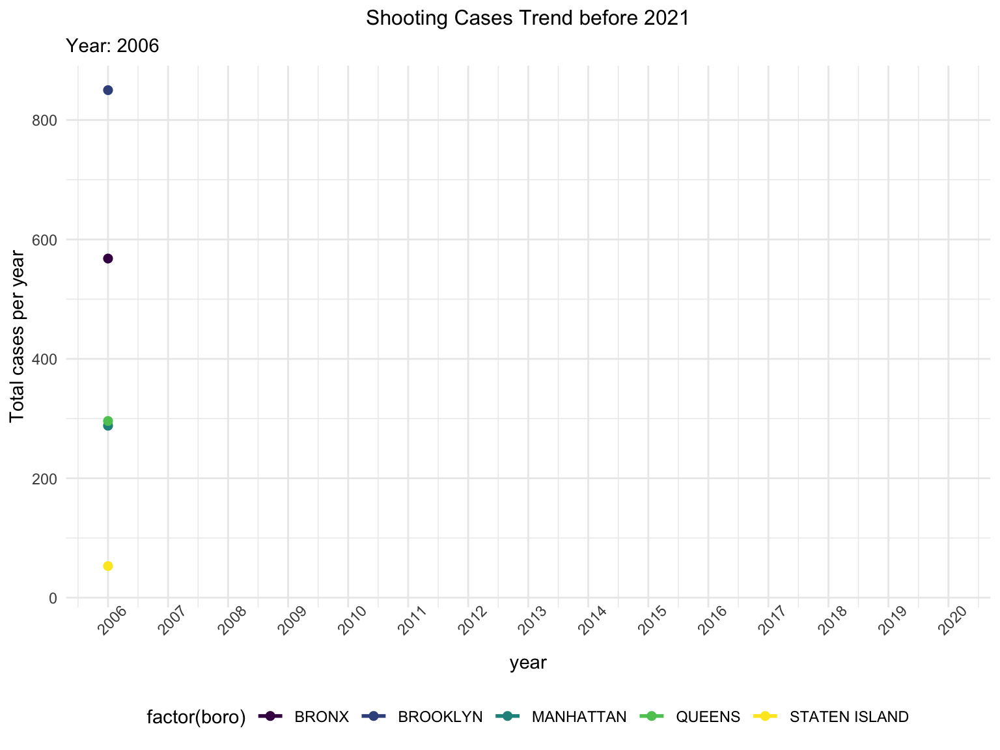

The Borough bar chart shows that Brooklyn area saw the most shooting cases(more than 10k) and Staten Island experienced the least shooting cases(less than 1k) in NYC from 2006 until now.

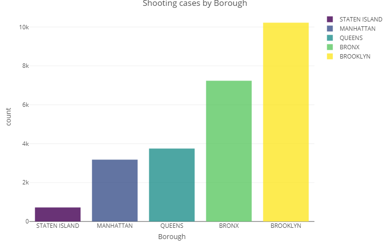

To assess the degrees of danger for different locations, cases with unrecorded location are dropped. Locations where shootings happened less than 10 times from 2006 until now are also dropped. We can see from the chart that public houses, apartment buildings and private houses are top 3 locations that shooting cases may happen.

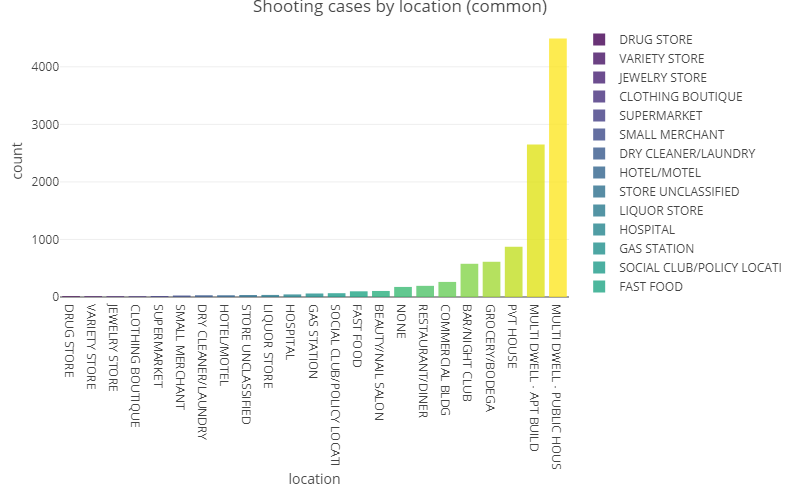

Besides, we are also interested in how distribution of shooting cases differs in different time within a day. The map shows the distribution in Borough and density by hours of all shooting cases from 2006 until now. From the animation, we can see shooting case are usually frequent in late night, decrease during daytime and gradually rise after sunset.

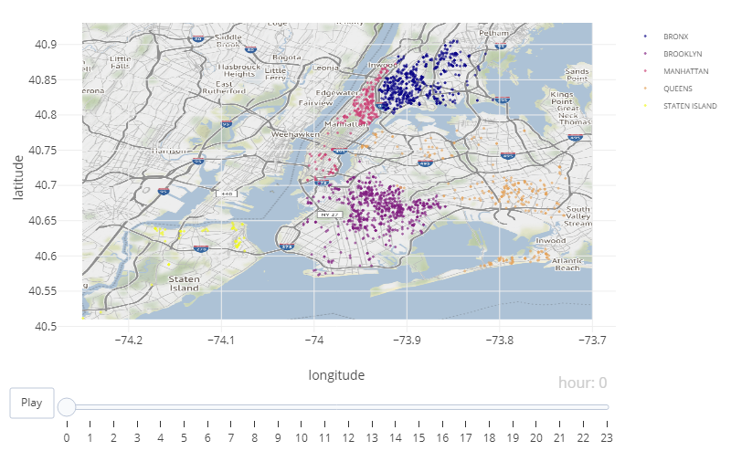


### Gender, Race and Age

Profile of both perpetrators and victims is another major concern. NYPD Shooting Incident Data provides age group, gender and race information of perpetrators and victims. We visualized these data as below.

From the Race and Sex Distribution bar chart we can see that male victims outweigh female victims in all races. Similarly, male perpetrators outweigh female in all races.

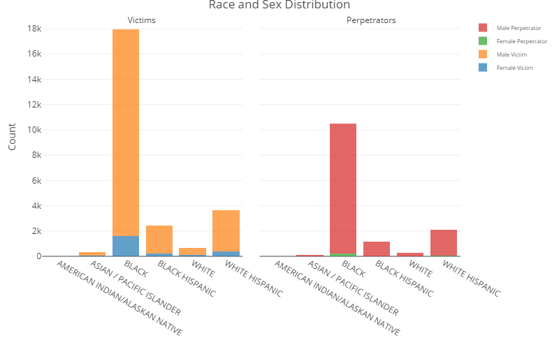

For both perpetrators and victims, men are more likely to be involved in a shooting case than women. However, this proportion is more significant in the perpetrator group than the victim group. From 2016 to 2021, there is no significant change in the proportion of gender.

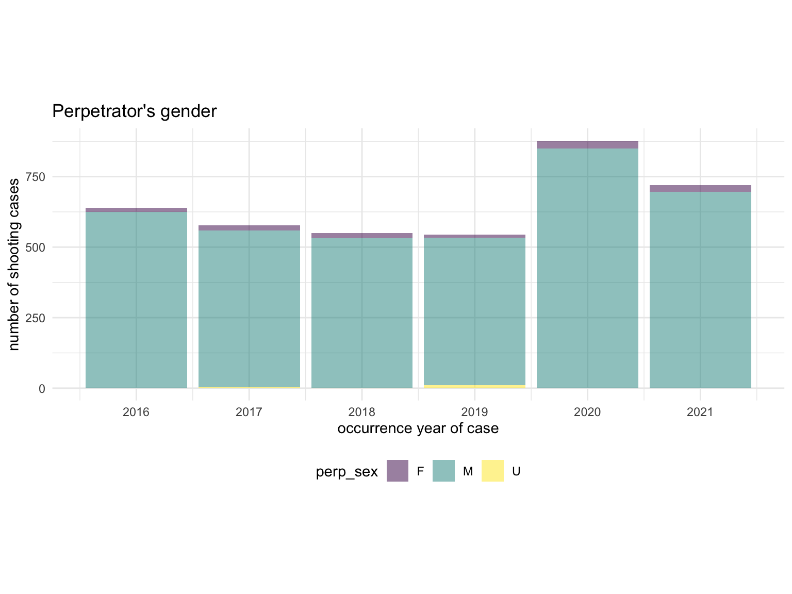


Age group is also a factor in interest. Most perpetrators are between 18-44 years old.

Similar to the age distribution of perpetrators, most victims are between 18-44 years old. And 3 most vulnerable races are black, white Hispanic and black Hispanic. For different races, the age distributions of victims are similar.

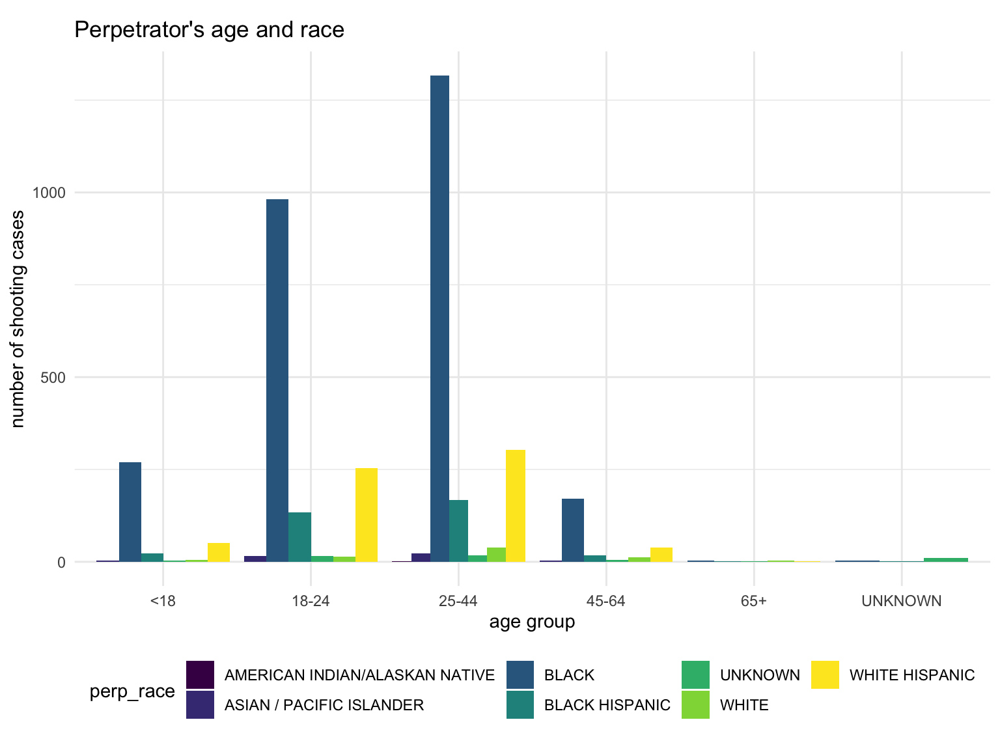

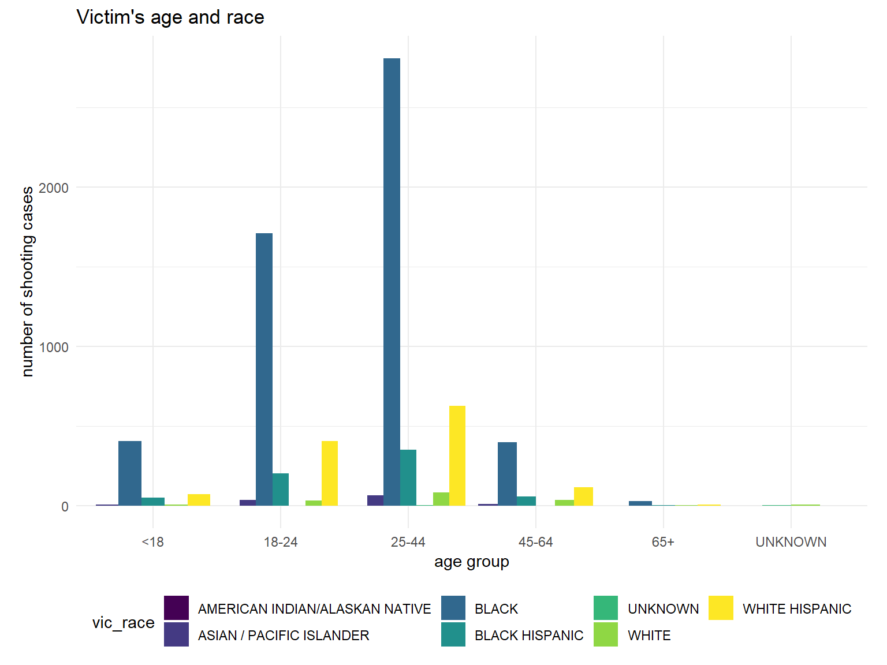


### Trend of Shooting Cases and Covid-19

From the Shooting Cases in Each Hour in NYC, we can see that shooting cases are more likely to happen in the dark than daytime, especially at midnight. And then the level decreases after 0:00 and reaches the lowest point in the morning. After 9 o’clock, it starts to increase again.

As for differences among months, cases are more likely to happen during summer than winter, which is also observed in the line plot Monthly Shooting Cases in NYC. Based on this fact, temperature is considered as one of the potential factors that may influence the frequency of shooting cases, which we’ll talk about at the end of the visualization part.

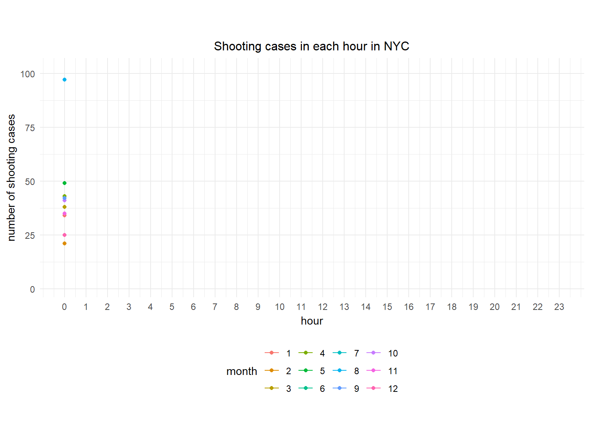

We have observed a rapid increase of shooting cases in 2020 in the trend plot grouped by borough. Thus, we naturally think of the impact of COVID-19 on shooting incidence.

To test our hypothesis that there might be an association between COVID-19 and the increase of shooting cases in 2020, we visualized the number of shooting cases by month for year 2016 to 2021. The line plot shows that the number of shooting cases increased rapidly in May 2020 which is right during the period of the first COVID-19 outbreak in NYC. As the pandemic persists, the number of shooting cases remained at a high level after April 2020.

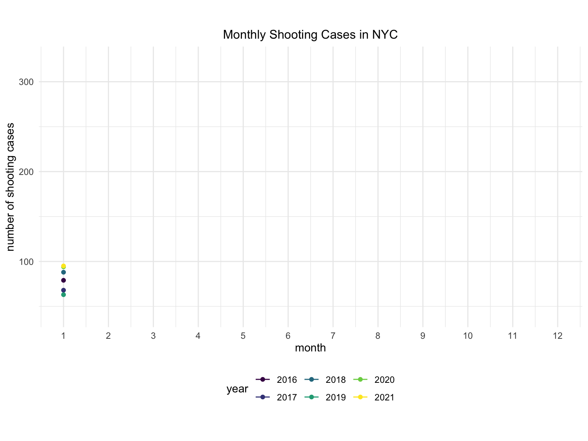

Further, to confirm that number of shooting cases is affected by COVID-19 and assess the level of influence, a YoY+% line plot is drawn to show the growth rate of # of cases year over year for each 12 months. Generally speaking, without great impact of major events, the growth rate is expected to be around 1. However, as the plot suggests, there is significant growths of shooting cases in 2020 compared with 2019 for months from May to December, while the growth rates remained around 1 for January to April due to the peace without COVID-19.

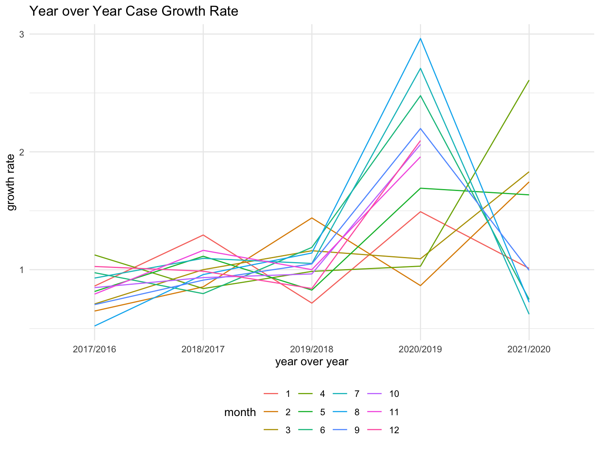

The cumulative chart shows accumulation of both COVID-19 cases and Shooting cases in NYC county from 2020-03-01 until 2021-09-30. In order to make the plot more readable, We divided the COVID-19 cumulative cases by 1000 due to its rapid growth rate compared to shooting cases. The bar chart shows a potential peak shifting fluctuation, instead of co-frequency resonance, which may be due to the delayed effect of COVID-19 on society. Therefore, we go deeper into the relationship between the accumulation of shooting cases and COVID cases.

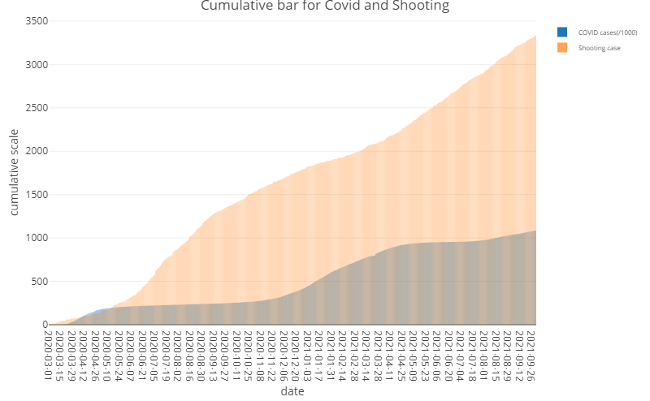

The linear plot clearly shows a steep rise in shooting cases when COVID-19 case accumulated to 200,000 on 2020-05-15 around in NYC. The growth rate becomes slower for nearly half a year from 2020-11-15 around, and then increases again since 2021-05, but not as rapid as in 2020. Combined with the month and shooting cases analysis before, increment in shooting cases during May is common, but the extremely high growth rate at the beginning of epidemic is unusual. What’s more, it is noteworthy that the spread of Delta virus also begins at the end of April, 2021.

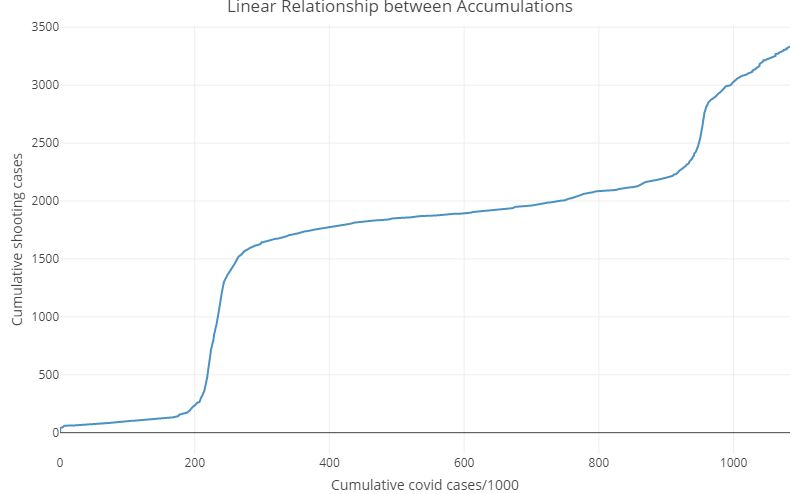


### Temperature

From BOTH of the line plots Shooting Cases in Each Hour in NYC and Monthly Shooting Cases in NYC, we can see that shooting cases in summer are more than in winter. To observe the relationship between temperature and frequency of shooting, we collected weather data from rnoaa package and calculated the average temperature in New York Central Park as a substitute for temperature in NYC.

As the Temperature Records in NYC and Daily Shooting Cases in NYC shows, the daily number of shooting cases fluctuates with the fluctuation of temperature. We can conclude that shootings fluctuate like a seasonal flu every year.


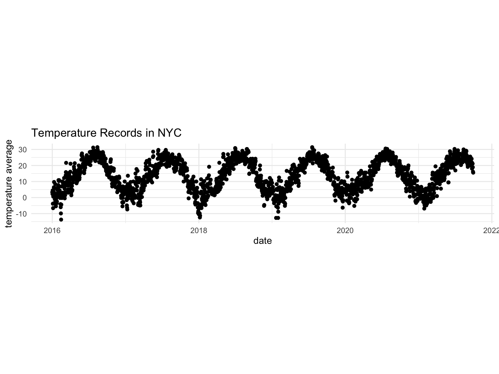

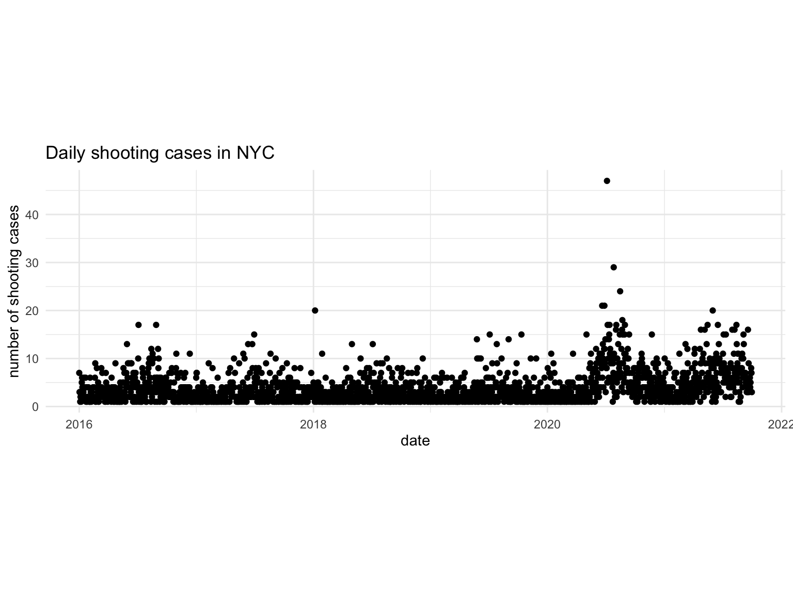

***

## Regression

### Anticipate challenges and solutions

Our data includes more categorical variables, which need a different way of fitting the regression model from the continuous predictors. In addition, how to select the appropriate variables to fit the regression model is still a challenge Based on the literature review, we understand that the shooting number in NYC may be explained by many factors including, social and economic determinants, education, living community, family condition, personal issues. And it is a great challenge to include all the factors in one regression model. Moreover, a linear regression model may be appropriate in such a complex situation. 

Our solution to the above challenge is to narrow the potential risk factors by focusing on our primary project question, and data availability. In the regression model fitting part, we used the backward stepwise method, correlation matrix, diagnosed method, and cross-validation to ensure the accuracy of our model.

### Box_Cox transformation

The box-cox method is applied in the model to determine the transformation of outcome variable. The variable `location_desc` includes too many missing value. It was not included in the multiple linear regression analysis. All the missing values from our dataset was omitted. The λ is close to - 2, 1 / Y^2 transformation is applied.

### Regression Results

After the transformation, we fit the multiple linear regression model and apply the backward stepwise method to select the best predictors. Below is the regression results
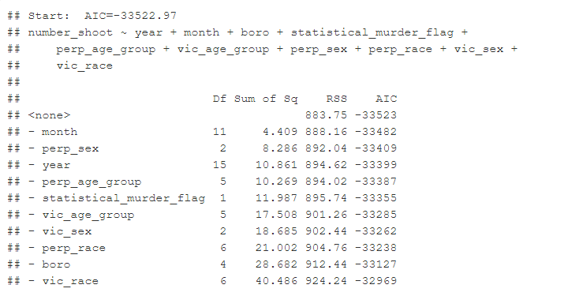
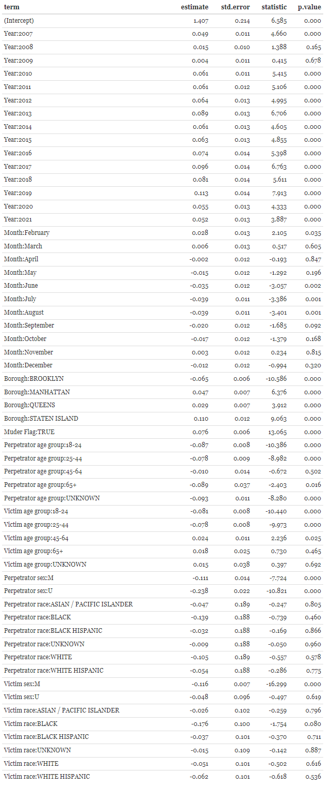
The regression analysis identified `year`, `borough`, `statistical murder flag`, `victim’s age group, and sex`, and `perpetrator’s sex` are significant predictors for the number of shooting cases in NYC. However, our predictors only explain 17 % of the outcome, which indicates that there are more factors influencing the booming case of shooting in NYC. The year 2019, 2020, and 2021 show an increased number of shootings when compared with 2006 while controlling other variables. In addition, we found race is not a strong and significant factor in predicting shooting numbers in NYC. And among the borough, compared with Bronx, Brooklyn have less number of shooting, and Manhattan, Queens, and Staten Island have more number of shooting.Among perpetrators, age under 18 have more number of shooting than other age groups. Among victims, 45-64 years old and 65+ years old have more number of shooting that age under 18 group.

### Correlation Matrix

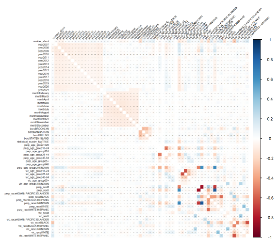

The correlation analysis of NYC shooting data shows that the unknown sex and race of perpetrator is highly collinearited. And most of other variables are acceptable.

### Multiple Linear Regression disgnose

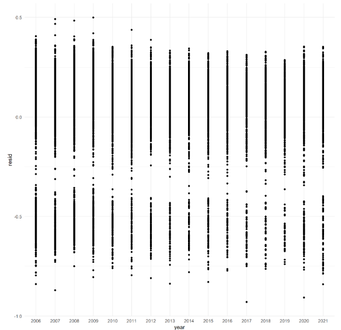
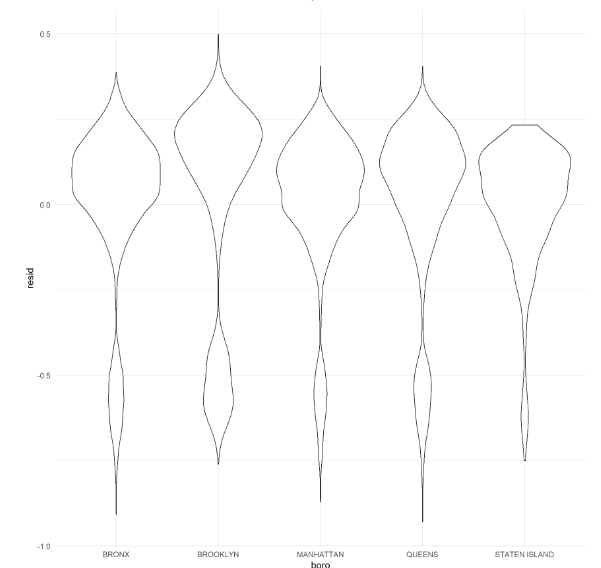
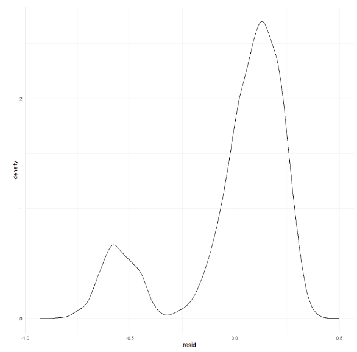
The residuals plot of year and borough did not show any distribution pattern which indicated the good fit of model. However, the residual density plot indicated some outliers.

### Cross Validation
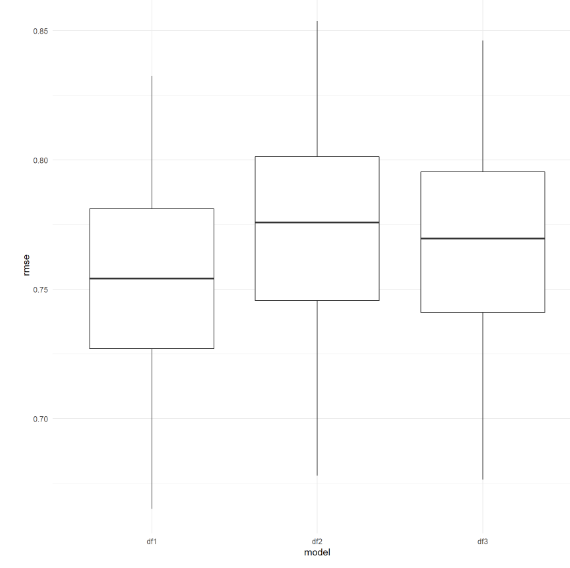
Our cross validation include three different models. The first model includes all the predictors. The second model includes only the significant predictors. the third model includes interaction of borough and sex.

The cross validation section, the root mean square deviations were calculated for all the three models. the RMSE plot shows that RMSE of all model are similar. And the first model have the lowest RMSE, which indicates the first model may be the best model to explain the outcome - number of shooting in NYC.

***

## Shiny App

**_Our Product: Initial Goal combined with Sparks_**

We used the `Shiny App` and `leaflet` package to build an interactive map that allows users to find the shooting incidents near them by inputting their zip code (in New York City), and our database includes over 25,000 data points on shooting incidents in NYC from 2006 ~ 2021 (data source: NYPD). The tool performs visualization of the geographic distribution of shooting incidents in the area defined by zip-code.


Here is an example of how our app works. After typing in the zip-code `10032` that I am interested in (where Mailman School of Public Health located in), the `NYC Shooting Incidents Map` will show all the shooting cases between Jan. 2006 and Sept. 2021 in 10032. And by zooming in and out, you can get more accurate and intuitive information about which street or neighborhood clusters have more shooting cases than others. The geographical scatter plots combined with the realistic NYC map will provide our users helpful guide for their safe trip.

In addition, to achieve our initial goal of making this app a handy tool to provide as comprehensive information as we can, we create two bar plots to show the number of shooting cases across `month` in a year as well as `hour` in a day in the area with given zip-code. At the beginning of our design, we just intend to provide the most "dangerous" month and hour to our users by showing a chart. While during our working process, as a newcomer of New York and a faithful user (even we are the creator) of this tool, we realized that instead of getting the "most" information, users may prefer to get the trend and comparative data as a tour guide, and that's the reason why we make such bar plots. As the users living in 10032, this resulting charts will guide us to stay at home after 18:00 and to hang out between 7:00 am and 4:00 pm. 

After getting the above products, a fantastic idea came into our mind: If we are planning our Thanksgiving holiday trip, we really want to know the hotels in which district would be the safest one to be chosen! Then, an out-of-plan map showing the shooting density of each area in NYC (defined by zip-code) was created. We use `highcharter` package to realize our goal, combining with an open-sourced nyc map provided by https://data.beta.nyc/dataset. We also stratified the data set by year to make the plot more meaningful. 

**_How We Achieve and Difficulties We Met_**

At the beginning of our design, we intended to make an interactive map (Shiny App) which provide information for travelers and residents in New York City about the risky areas and dangerous time on shooting incidents, which could give them helpful instructions on planning their trips. To make this tool as handy as we hope, we should find a connection between users and our database which should satisfied the following requirements: 

1) Easy to search (counter-example longitude and latitude); 

2) Well-known and intuitive (counter-example: precinct divided for NYPD, included in our database); 

3) A clearly defined area with enough data points to display (counter-example: a block).

Therefore, zip-code will be an ideal candidate, and our task change to how to generate zip-code from the GPS point provided in the data set. 

Here we created a function called `latlon2zip`. Firstly, we embedded the parameters of longitude and latitude into the pre-specified url string, and then using the combined url to get the response from the website with the geographical data of JSON format. In this way, we can extract the zip-code information from JSON data. Then we iterated these steps into the whole dataframe.

```{r eval=FALSE}
latlon2zip = function(lat, lon) {
  
    url = sprintf("http://nominatim.openstreetmap.org/reverse?format=json&lat=%f&lon=%f&zoom=18&addressdetails=1", lat, lon)
    
    res = jsonlite::fromJSON(url)
    
    zipcode = 
      res[["address"]][["postcode"]] %>% 
      noquote() %>% 
      as.numeric()
    
    return(zipcode)
    
}
```


A problem need to be solved in the next part is the running time. Because generating one zip-code takes 1s, generating the zip-codes for the whole data set can be quite time-consuming. To minimize the running time, we tried to replace the `rjson::fromJSON()` by `jsonlite::fromJSON()`. Therefore, the running time for one zip-code shrink to 0.5s which is better. 

The most ideal generating process of new dataframe with zipcode is using the `latlon2zip` function to get all zip-codes for 20,000 data points from 2016 to 2021 at once, while it is unfeasible. The problem we confronted was that the time to generate one zip-code from one (lat, lon) in R is 0.5s. And then for  20,000 records, running time will be 3h (actually we tried, but R told us "time run out" and collapse...). 

Then, we decided to generate the zip-code year-by-year, and merge these data set together. 
Examples on how we get and merge resulting csv files in `comp_data` folder could be found in our website. We have tried to add labels of street address and other accurate information on each scatter point. However, adding address could not be realized since the way to do this is connecting the `Open Street Map` for more geographical information, and this process is similar to how we get zip-code. But we can not simply do this because the connecting and extracting process takes 0.5 s for each data point which highly decrease the fluency of our tool. And if we reversely importing all the address information to our local database, and provide them from existed local file when users asking, then complex string modification need to be taken for the address information recorded in `Open Street Map` is not ideal. Consequently, we didn't create labels for our data points since the map embedded is clear and users can get the address info easily  by zooming in.

Also, `highcharter` is a wonderful but difficult task for us. The first thing we confronted is: how to bind our data with a NYC map by zip-code. Unlike `shooting finder` above, what were trying to bind this time is not `GPS point` vs. `marker`, actually it is dataframe vs. map properties. To achieve this task, we find a NYC open-sourced map (that could be extracted as a JSON file) with properties of zip-code (there were several failures before we finally success, and the reasons for the failures is the maps we found do not contain `zipcode`), and combined the `zipcode` with the map. And here came a second problem which we have not tackled yet: how to show the names (eg. 10032) within series. Finally, we renamed the series name as `Number of Shooting Cases:`, but can not figured out how to display the row names within this series. Due to the limitation of time, we will keep trying to make this plot better. 


***

## Discussion

Through visualization, we obtained a thorough picture of shooting cases in New York City. By classifying cases by boroughs and showing trends, we observed that Brooklyn saw most shooting cases while Staten Island was the safest borough in the past 16 years, and as expected, the numbers of shooting cases increased in 2020 in all of the 5 boroughs in NYC, which might be resulted by the occurrence of COVID-19. We also compared the frequency of shootings in different hours and in distinct months and we found that shooting incidence is more likely to occur at night as we expected and has seasonality like a flu. Shooting incidence is still a public issue, especially with the continuous pandemic which may have resulted in the reincrease of shooting cases. In order to reduce shooting incidence and other violence, police force should be strengthened in some key boroughs like Brooklyn, especially during summer. Preventing the further spread of COVID-19 is another important mission to maintain social stability and to reduce shootings. 

In regression part, the raw data included many categorical variables, which amplified the difficulty in fitting a regression model. To ensure the accuracy of our regression model, we utilized the backward stepwise method and correlation matrix to select the appropriate variables to fit our regression model. We also conducted a regression model diagnosis and cross-validation to inspect the validity of our regression model. However, our predictors only explain 17 % of the outcome, which indicates that there are more factors influencing the booming case of shooting in NYC. The regression model indicates that race is not a valuable and significant predictor of shooting number, which means the comprehensive impact of the Covid-19 pandemic on everyone everywhere. Borough is identified as a strong and significant predictor of shooting numbers in NYC by our regression model and data visualization. We can observe the different densities of shooting numbers in different boroughs of NYC, which implies the inequalities and disparities of different boroughs.

