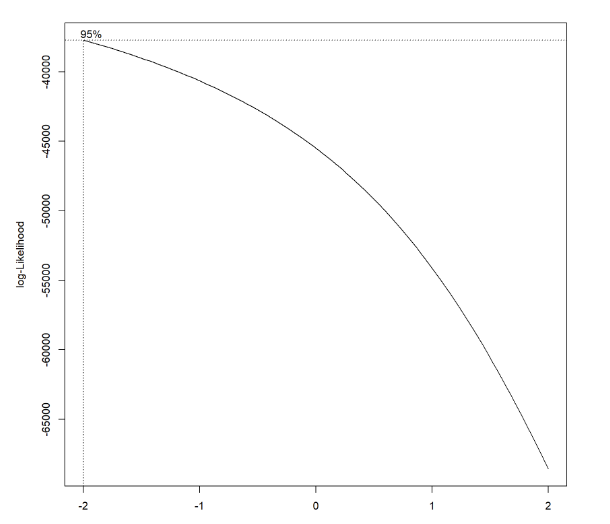

Yu He (yh3430), Wenshan Qu (wq2160), Jiayao Sun (js5962), Yimiao Pang (yp2608), Yunxi Zhang (yz4186)

***

## Motivation

The proliferation of guns and gun violence in the United States have serious consequences. In addition to causing many casualties, it also spawned more violence and crime, reducing public security in American society. According to the Council on Criminal Justice data, there has been a sharp increase in homicides in the United States in 2020. Data from 21 cities showed that compared with the fall of 2019, there were 610 homicides in the same period in 2020, malicious injury cases increased by 15% and 13%, and shooting cases increased by 15% and 16%, respectively. According to the New York Post, data from the New York City Police Department shows that as of December 7, 2020, there have been 1,433 shootings in New York City, with a total of 1,756 victims of gun violence, almost twice the number in the same period in 2019. The surge in shootings is jeopardizing the rights of the public. We need immediate action to reshape our community to provide a safe living environment for our community members.

***

## Questions

* What is a relatively safe time to go outside in a day?
* How many shooting incidents have occurred in the past few years in the nearby  area?
* Does the month affect the possibility of shooting incidents?
* How are the shooting incidents distributed in NYC?
* How does COVID-19 influence the shooting incidents rate?
* Is there any way to control the number of shooting incidents in NYC?

***

## Data

###  Data Source
* The NYPD Shooting Incident Data (Year To Date) - [link](https://data.cityofnewyork.us/Public-Safety/NYPD-Shooting-Incident-Data-Year-To-Date-/5ucz-vwe8)

  The dataset is downloaded from _NYC Open Data_. It contains 1531 shooting incidents that occurred in NYC from Jan. 1th 2021 to Sep. 30th 2021. The data was manually extracted every quarter and reviewed by the Office of Management Analysis and Planning. Each observation represents a shooting incident in NYC and includes information about the event, the location, the time of occurrence, and the information related to suspect and victim demographics.


* The NYPD Shooting Incident Data (Historic) - [link](https://data.cityofnewyork.us/Public-Safety/NYPD-Shooting-Incident-Data-Historic-/833y-fsy8)

  The dataset is downloaded from _NYC Open Data_. It contains 26.3K shooting incidents that occurred in NYC during the 2006 and 2020 fiscal years. The information contained in this data is the same as the NYPD Shooting Incident Data(Year To Date).
  
* The US County-level COVID-19 Data(us-counties) - [link](https://github.com/nytimes/covid-19-data)

  The dataset is downloaded from _The New York Times_.  It contains 1.99M entries and 6 columns with COVID-19 cases and deaths each day from Jan 21, 2020 until now by counties in the US.

### Data Cleaning and Processing

The first step of raw data cleaning combines each year’s data into one file. Then the date variable was separated into year, month, and day variables for later analysis. The missing value and unexpected values were omitted from the dataset.

### Data Description

The NYPD Shooting Data was collected from the NYC Open Data, The dataset includes 1,531 rows and 19 columns. The variables included in the dataset were listed below:

| Variable                                                                                           | Description                                                                                                                                                                            |   |   |   |
|----------------------------------------------------------------------------------------------------|----------------------------------------------------------------------------------------------------------------------------------------------------------------------------------------|---|---|---|
| incident_key                                                                                       | Randomly generated persistent ID for each arrest                                                                                                                                       |   |   |   |
| occur_date                                                                                         | Exact date of the shooting incident                                                                                                                                                    |   |   |   |
| occur_time                                                                                         | Exact time of the shooting incident                                                                                                                                                    |   |   |   |
| boro                                                                                               | Boro where the shooting incident occurred                                                                                                                                              |   |   |   |
| precinct                                                                                           | Precinct where the shooting incident occurred                                                                                                                                          |   |   |   |
| jurisdiction_code                                                                                  | Jurisdiction where the shooting incident occurred.     Jurisdiction codes 0(Patrol), 1(Transit) and 2(Housing) represent NYPD whilst codes 3 and more represent non NYPD jurisdictions |   |   |   |
| Location_desc                                                                                      | Location of the shooting incident                                                                                                                                                      |   |   |   |
| statistical_murder_flag                                                                            | Shooting resulted in the victim’s death which would be counted as a murder                                                                                                             |   |   |   |
| perp_age_group                                                                                     | Perpetrator’s age within a category                                                                                                                                                    |   |   |   |
| perp_sex                                                                                           | Perpetrator’s sex description                                                                                                                                                          |   |   |   |
| perp_race                                                                                          | Perpetrator’s race description                                                                                                                                                         |   |   |   |
| vic_age_group                                                                                      | Victim’s age within a category                                                                                                                                                         |   |   |   |
| vic_sex                                                                                            | Victim’s sex description                                                                                                                                                               |   |   |   |
| vic_race                                                                                           | Victim’s race description                                                                                                                                                              |   |   |   |
| x_coord_cd                                                                                         | Midblock X-coordinate for New York State Plane Coordinate System, Long Island Zone, NAD 83, units feet (FIPS 3104)                                                                     |   |   |   |
| y_coord_cd                                                                                         | Midblock Y-coordinate for New York State Plane Coordinate System, Long Island Zone, NAD 83, units feet (FIPS 3104)                                                                     |   |   |   |
| latitude                                                                                           | Latitude coordinate for Global Coordinate System, WGS 1984, decimal degrees (EPSG 4326)                                                                                                |   |   |   |
| longitude                                                                                          | Longitude coordinate for Global Coordinate System, WGS 1984, decimal degrees (EPSG 4326)                                                                                               |   |   |   |
| lon_lat                                                                                            | Longitude and Latitude Coordinates for mapping                                                                                                                                         |   |   |   |

## Data Visualization


### Borough and Location

#### Shooting Cases Trend before 2021 by Borough

The line plot below shows the trend of shooting cases in NYC by borough before 2021, because data in 2021 is only until the end of September. Obviously, the shooting cases’ distribution among boroughs does not change over year. For example, the number of cases in Brooklyn remained 1st among 5 boroughs in NYC from 2006 to 2021. Even though shooting rate decreased dramatically since 2014, there was a steep rise in 2020, which probably was resulted from the emergence of COVID-19.


#### Shooting Cases by Location

Cases with unrecorded locations are dropped, and locations where shootings happened less than 10 times from 2006 until now are also dropped.We can see from the chart that public houses, apartment buildings and private houses are top 3 locations where shooting cases happened.


### Gender, Race and Age

#### Gender Proportions from 2016 to 2021

For both perpetrator and victim group, men are more likely to be involved in a shooting case than women. However, this proportion is more significant in the perpetrator group than the victim group. From 2016 to 2021, there is no significant change in the proportion of gender.


#### Gender and Race Distributions

From the bar chart we can see most victims in NYC shooting cases from 2006 until now are male in Black. Broadly, male victims outweigh female victims in all races.

The bar chart of sex and race distribution of perpetrators is similar to that of victims. Broadly, male perpetrators outweigh female in all races.


#### Age and Race Distributions

Age group is also a factor in interest. Most perpetrators are between 18-44 years old.

Similar to the age distribution of perpetrators, most victims are also between 18-44 years old. And the 3 most vulnerable races are black, white Hispanic and black Hispanic. For different races, the age distributions of victims are similar.


### Trend of Shooting Cases and Covid-19

#### Shooting Cases by Hour for Each Month

From the Shooting Cases in Each Hour in NYC, we can see that shooting cases are more likely to happen in the dark than daytime, especially at midnight. And then the level decreases after 0:00 and reaches the lowest point in the morning. After 9 o'clock, it starts to increase again.

As for differences among months, cases are more likely to happen during summer than winter. Based on this fact, temperature are considered as one of the potential factors that may influence the frequency of shooting cases.


#### YoY+% and COVID-19

To confirm the hypothesis that number of shooting cases is affected by COVID-19, a YoY+% line plot is drawn to show the growth rate of # of cases year over year for each 12 months. Without great influence of major events, the growth rate is expected to be around 1. However, as the plot below suggests, there is significant growths of shooting cases in 2020 compared with 2019 for months from May to December, while the growth rates remained around 1 for January to April due to the precious peace without COVID-19.


### Temperature

Based on the fact that shooting cases in summer are more than in winter, we are interested in the question whether the frequency of shooting cases is influenced by temperature. To observe the relationship between temperature and frequency of shooting, we collected weather data from rnoaa package and calculated the average temperature in New York Central Park as a substitute for temperature in NYC.

As the Temperature Records in NYC and Daily Shooting Cases in NYC shows, the daily number of shooting cases fluctuates with the fluctuation of temperature. We can conclude that shootings fluctuate like a seasonal flu every year.


## Regression

### Box_Cox transformation

The box-cox method is applied in the model to determine the transformation of outcome variable. The variable `location_desc` includes too many missing value. It was not included in the multiple linear regression analysis. All the missing values from our dataset was omitted. The λ is close to - 2, 1 / Y^2 transformation is applied.

### Regression Results

After the transformation, we fit the multiple linear regression model and apply the backward stepwise method to select the best predictors. Below is the regression results


The regression analysis identified `year`, `borough`, `statistical murder flag`, `victim’s age group, and sex`, and `perpetrator’s sex` are significant predictors for the number of shooting cases in NYC. However, our predictors only explain 17 % of the outcome, which indicates that there are more factors influencing the booming case of shooting in NYC. The year 2019, 2020, and 2021 show an increased number of shootings when compared with 2006 while controlling other variables. In addition, we found race is not a strong and significant factor in predicting shooting numbers in NYC. And among the borough, compared with Bronx, Brooklyn have less number of shooting, and Manhattan, Queens, and Staten Island have more number of shooting.Among perpetrators, age under 18 have more number of shooting than other age groups. Among victims, 45-64 years old and 65+ years old have more number of shooting that age under 18 group.

### Correlation Matrix


The correlation analysis of NYC shooting data shows that the unknown sex and race of perpetrator is highly collinearited. And most of other variables are acceptable.

### Multiple Linear Regression disgnose


The residuals plot of year and borough did not show any distribution pattern which indicated the good fit of model. However, the residual density plot indicated some outliers.

### Cross Validation

Our cross validation include three different models. The first model includes all the predictors. The second model includes only the significant predictors. the third model includes interaction of borough and sex.

The cross validation section, the root mean square deviations were calculated for all the three models. the RMSE plot shows that RMSE of all model are similar. And the first model have the lowest RMSE, which indicates the first model may be the best model to explain the outcome - number of shooting in NYC.

## Shiny App

**_Our Product: Initial Goal combined with Sparks_**

We used the `Shiny App` and `leaflet` package to build an interactive map that allows users to find the shooting incidents near them by inputting their zip code (in New York City), and our database includes over 25,000 data points on shooting incidents in NYC from 2006 ~ 2021 (data source: NYPD). The tool performs visualization of the geographic distribution of shooting incidents in the area defined by zip-code.


Here is an example on how our app works. After typing in the zip-code `10032` that I am interested in (where Mailman School of Public Health belongs to), the `NYC Shooting Incidents Map` will show all the shooting cases between Jan. 2006 and Sept. 2021 in 10032, and by zooming in and out the map, you can get more accurate and intuitive information on which street or neighborhood clusters more shooting cases than others. The geographical scatter plots combined with the realistic NYC map will definitely provide our users with helpful guide on their safe trip.

Also, to achieve our initial goal of making this app a handy tool to provide as comprehensive information as we can, we create bar plots to show the number of shooting cases across `month` in a year as well as `hour` in a day in the area with given zip-code. At the beginning of our design, we just intend to provide the most "dangerous" month and hour to our users with a chart. While during our working process, as a newcomer of New York and a faithful user (even we are the creator) of this tool, we realized that instead of getting the "most" information, we prefer to get the trend and comparative data as a tour guide, and that's the reason why we make such bar plots. As a user who lives in 10032, this resulting charts will help me to make decisions of "stay at home after 18:00" and "better hang out between 7:00 am to 4:00 pm".

After getting the above products, an fantastic idea came into my mind immediately: If I am planning my Thanksgiving holiday trip, I really want to know the hotels in which district would be the safest one to be chosen! Then, an out-of-plan map showing the shooting density of each area in NYC (defined by zip-code) was created. We use `highcharter` package to realize our goal, combining with an open-sourced nyc map provided by https://data.beta.nyc/dataset. We also stratified the data set by year to make the plot more meaningful. 

**_How We Achieve and Difficulties We Met_**

At the very beginning of our design, we intended to make a interactive map (Shiny App) which could provide information for travelers and residents in New York City about the risky areas and dangerous time on shooting incidents, which could give them helpful instructions on planning their trips. To make this tool as handy as we hope, we should find a "connector" between users and our database. This connector should be: 

1) easy for users to enter in the sidebar (counter-example: longitude and latitude data); 

2) well-known and intuitive (counter-example: precinct divided for NYPD, included in our database); 

3) a area (instead of a point) that contains enough data points to display (counter-example: an accurate apartment address).

Then, zip-code will be an ideal candidate, and our task turns to how to generate zip-code from the GPS point provided in the data set.

Here we create a function called `latlon2zip`. To create function `latlon2zip`, firstly, we embedded the parameters of longitude and latitude into the pre-specified url string, and then using the combined url to get the response from the website with the geographical data of JSON format. In this way, we can extract the zip-code information from JSON data. Then we iterated these steps into the whole dataframe.

```{r eval=FALSE}
latlon2zip = function(lat, lon) {
  
    url = sprintf("http://nominatim.openstreetmap.org/reverse?format=json&lat=%f&lon=%f&zoom=18&addressdetails=1", lat, lon)
    
    res = jsonlite::fromJSON(url)
    
    zipcode = 
      res[["address"]][["postcode"]] %>% 
      noquote() %>% 
      as.numeric()
    
    return(zipcode)
    
}
```


A tough problem we are going to solve in the next part is the running time, because generating one zip-code will take 1s, thus making the process of generating the zip-codes for the whole data set to be quite time-consuming. To optimize the running time, I try to use different packages: `jsonlite::fromJSON()` to replace the `rjson::fromJSON()`, and the running time for one zip-code shrink to 0.5s, which is more acceptable than before. 

The most ideal generating process of new datafram with zipcode is using the `latlon2zip` function to get all zip-codes for 20,000 data points from 2016 to 2021 at once, while it is unfeasible. The problem we confronted with is that the time R uses to generate one zip-code from one (lat, lon) is 0.5s, and for  20,000 records, running time will be 3h (actually we tried, but R told us "time run out" and collapse...). 

Then, we decided to generate the zip-code year-by-year, and merge these data set together. 
Examples on how we get and merge resulting csv files in `comp_data` folder could be found in our website, but a "miserable truth" we found here is that we can not at this time realize the most exciting idea to optimize this interactive tool: adding labels with accurate street address and other accurate case information on each scatter point. The formal one (which is street address) could not be realized because technically the preferred way to do this is by connecting the `Open Street Map` to get more complex geographical information, and this process is highly similar with how we get zip-code, but we can not simply do this because the connecting and extracting process took 0.5 s for each data point, which will highly decrease the fluency of our tool. And if we do this reversely, which means we will import all the address information to our local database, and provide them from existed local file when users asking, then complex string modification need to be taken for the address information recorded in `Open Street Map` is not as ideal as we hope. Consequently, we didn't create labels for our data points, but fortunately, the map embedded is clear enough and users could simply get the address info by zooming in the map.

Also, `highcharter` is a wonderful but difficult task for us. The first thing we confronted with is: how to bind our data with a NYC map by zip-code. Unlike `shooting finder` above, what were trying to bind this time is not `GPS point` vs. `marker`, actually it is dataframe vs. map properties. To achieve this task, we find a NYC open-sourced map (that could be extracted as a JSON file) with properties of zip-code (there were several failures before we finally success, and the reasons for the failures is the maps we found do not contain `zipcode`), and combined the `zipcode` with the map. And here came a second problem which we have not tackled yet: how to show the names (eg. 10032) within series. Now we can just find way to rename the series name as `Number of Shooting Cases:`, but can not find solution of displaying the row names within this series. Due to the limitation of time, we will keep trying to make this plot as perfect as we can.  

## Conclusion

## Discussion
(regression part)The raw data included many categorical variables, which amplified the difficulty in fitting a regression model. To ensure the accuracy of our regression model, we utilized the backward stepwise method and correlation matrix to select the appropriate variables to fit our regression model. We also conducted a regression model diagnosis and cross-validation to inspect the validity of our regression model. However, our predictors only explain 17 % of the outcome, which indicates that there are more factors influencing the booming case of shooting in NYC. The regression model indicates that race is not a valuable and significant predictor of shooting number, which means the comprehensive impact of the Covid-19 pandemic on everyone everywhere. Borough is identified as a strong and significant predictor of shooting numbers in NYC by our regression model and data visualization. We can observe the different densities of shooting numbers in different boroughs of NYC, which implies the inequalities and disparities of different boroughs.

